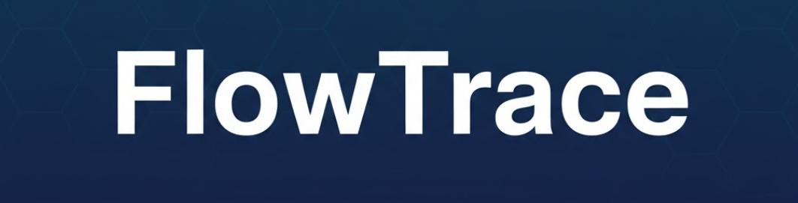

# FlowTrace

An AI-powered pipeline that automatically tracks and analyzes your computer activity. All processing is done locally to ensure privacy.

## Prerequisites

- **Operating System**: Developed for Windows; compatible with macOS/Linux with minor modifications (see below)
- **Python**: Version 3.12 recommended
- **Hardware**: Runs on CPU or GPU (GPU recommended for faster processing)

## Setup
**IMPORTANT: macOS and other OS** users should read the **Platform Compatibility** section before continuing

### 1. Clone the Repository
```bash
git clone https://github.com/Merxon22/FlowTrace.git
cd FlowTrace
```

### 2. Configure Python Environment
Create a virtual environment and install dependencies:
```bash
python3 -m venv ./venv
```
Activate the environment and:
```
pip install -r requirements.txt
```

**Note**: If using a custom virtual environment name or conda, update the python paths in `./scripts/main.bat` and `./scripts/auto_screen_capture.bat` accordingly.

### 3. Install Llama Server
Install [llama.cpp](https://github.com/ggml-org/llama.cpp) to run local AI models:

**Windows**:
```bash
winget install llama.cpp
```

Verify installation:
```bash
where llama-server
```

For other platforms, see the [llama.cpp installation guide](https://github.com/ggml-org/llama.cpp/blob/master/docs/install.md).

### 4. Download AI Models
This project uses Qwen3 models in GGUF format. Alternative **[GGUF](https://en.wikipedia.org/wiki/Llama.cpp#GGUF_file_format)** models can also be used. Qwen3 was preferred because:
-  **Great performance**
- **Has officially-released gguf versions:** more reliable, less hassle
- **Has models in different sizes:** most people can probably find the right model that runs on their machine.

Refer to the "FAQ" section to learn about how to find the model that fits your machine. For an RTX 3060 12GB, these models work well:
- `Qwen3VL-4B-Instruct-Q4_K_M.gguf` and its `mproj` file (`mmproj-Qwen3VL-4B-Instruct-Q8_0.gguf`) found **[here](https://huggingface.co/Qwen/Qwen3-VL-4B-Instruct-GGUF/tree/main)**. The `mproj` file is necessary for a VLM model to perform visual task.
- `Qwen3-8B-Q4_K_M.gguf` found **[here](https://huggingface.co/Qwen/Qwen3-8B-GGUF/tree/main)**.

### 5. Configure Settings
Edit `./scripts/config.json` with your model paths:

```json
{
    "vlm_model_path": "../pretrained_models/Qwen3VL-4B-Instruct-Q4_K_M.gguf",
    "vlm_proj_path": "../pretrained_models/mmproj-Qwen3VL-4B-Instruct-Q8_0.gguf",
    "llm_model_path": "../pretrained_models/Qwen3-8B-Q4_K_M.gguf"
}
```

**Optional settings**:
- `capture_interval`: Screenshot interval in seconds
- `start_of_day`: Hour when a new day begins (assuming people might still be awake after 12 a.m.)

## Usage
FlowTrace has two components:
### 1. Screen Capture
Run the screen capture script to start a console window and begin logging your activity:
```bash
./scripts/auto_screen_capture.bat
```

Screenshots are saved to `./screenshots` with idle user detection to avoid redundant captures.

**Tips**:
- Create a desktop shortcut for quick access
- Add to Windows startup folder (`Win+R` → `shell:startup`) for automatic launching

### 2. Report Generation
Generate an activity report for the previous day. E.g., if you set `start_of_day` as 6 and call this batch file on Feb 4 after 6:00 a.m., it will generate a report based on the screenshots taken between Feb 3 6:00 a.m. and Feb 4 5:59 a.m.
```bash
./scripts/main.bat
```

The report PDF will be saved to your desktop by default. You can modify the save path in `./scripts/main.py`

**To Generate reports for specific dates**:
```bash
./scripts/main.bat --date 2026-02-15
```

## Platform Compatibility
For users using macOS or Linux:
1. Install llama-server using the appropriate method for your platform (refer to their [GitHub](https://github.com/ggml-org/llama.cpp))
2. Convert batch files and their content (`auto_screen_capture.bat` and `main.bat`) to corresponding shell scripts. Update Python paths in the shell scripts to match your virtual environment

## Potential FAQ

**Q: How much disk space do screenshots consume?**  
A: Images are resized to be smaller than 1920x1080 and are stored in JPEG format. **A typical image takes up only 100KB to 200KB of space**, meaning that every 60 images (1 hour of use time) take up less than 10MB on average.

**Q: Can I run this without a GPU?**  
A: Yes, llama server should theoretically handle the hardware compatibilities. Processing might be slower, but CPU models that have NPU support can still run at a reasonable speed. CPU mode allows running larger models due to greater RAM availability compared to typical VRAM. Potentially, if you have a large RAM, try out **MoE models like "30B-A3B"**; they are the models that require larger VRAM/RAM but runs faster. 

**Q: How do I choose the right model?**  
A: The model selection in Setup guide runs well on a RTX 3060 12GB GPU, and takes about 20 minutes to process a 10-hour-long period (about 600 screenshots). To find a model that fits best on your machine:
- The **Q4** quantization model is recommended: great balance between accuracy and VRAM requirement.
- If a model takes up too much VRAM/RAM, **try look for smaller quantized models first** (Q8 > Q6 > Q5 > Q4..., Q4 requires less space), but it's not recommended to go below Q4 (it loses too much accuracy). Then, try look for a model with smaller parameter size (8B > 4B > 2B...)
- If a model runs too slow on your machine, try look for models with a smaller parameter size
- For high-VRAM (or RAM) systems, consider MoE models (e.g., 30B-A3B) for faster processing

**Q: Are screenshots automatically deleted?**  
A: At the current stage, this project does not automatically delete past screenshots because:
- They do not take up a lot of space
- With historical screenshots, you are free to develop even crazier algorithms like "Compare my current week to past week" or "Store my activity history in a vector database so I can apply a search algorithm when needed"

**Note:** If you want to delete the screenshots manually, don't forget the `./outputs` folder. Those are condensed versions of your activity log stored in text format (generated by VLM and LLM). Delete them to completely wipe out your trace.

**Q: Don't you feel uncomfortable having an algorithm that monitors your actions?**  
A: Not really. FlowTrace was developed as a tool to perform better self-introspection, not as a "deadline pusher" that critiques user's activities. In fact, the models were purposefully prompted to **"honestly identify both productivity-related non-productivity-related activities"** and **"summarize the day objectively without judging the user**. Whether to use the report as a way to pressure themselves is up to the user to decide.
